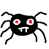

# Apprendre Python

Ceci est un support de cours accompagné d’une petite librarie destinée à aider les parents à initier leurs enfants à la programmation en Python, en français.

Les premiers chapitres introduisent les notions fondamentales : variables, boucles et conditions. Ensuite, le cours aborde la gestion des graphiques, du son et des entrées/sorties utilisateur.

À la fin du parcours, l’enfant sera capable de programmer de petits jeux grâce à une bibliothèque simplifiée (`jeu.py`) incluse dans le project. Celle-ci a été conçue pour éviter la gestion complexe des fenêtres, des ressources et d’autres notions techniques indispensables à la création de contenus multimédias, mais trop difficiles à aborder au début de l’apprentissage de la programmation.

Le cours ne traite pas de l’installation de Python. L’idée est qu’un parent compétent configure au préalable un IDE et un terminal (par exemple Visual Studio Code avec F5 pour lancer le programme), puis accompagne l’enfant tout au long des chapitres.
